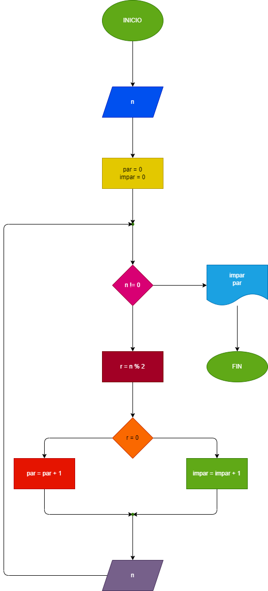

# Ejercicio 2
Hacer el diagram de flujo y el programa en Python, que lea numeros enteros y positivos (uno en cada lectura), y que averigüe e imprima cuantos son pares y cuantos son impares. Para terminar utilizaremos el registro centinela, cuando el valor del numero leido sea cero.

